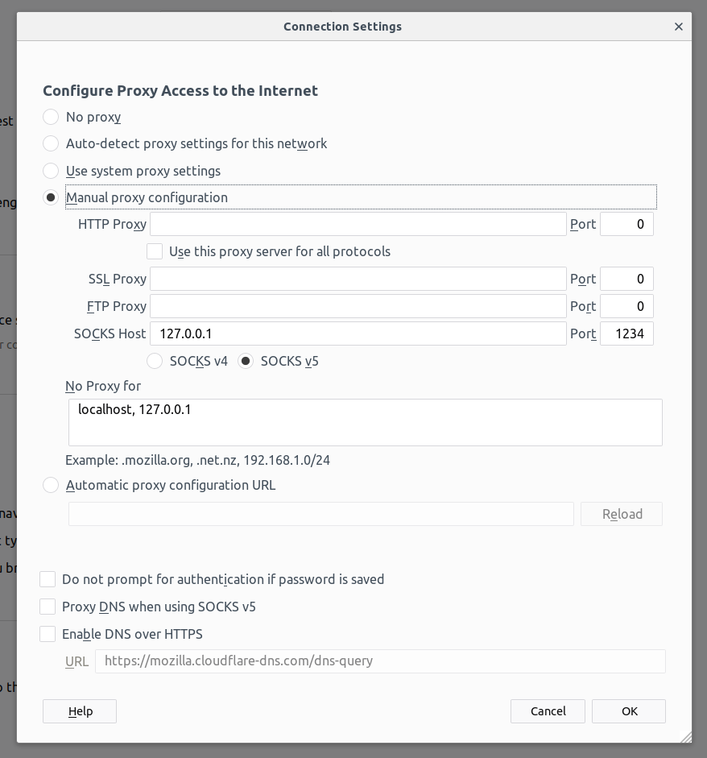

# Overview

Each group is assigned a given VirtualMachine (VM) on the *PhysicsOfData-students* project on CloudVeneto.
VM are named *LCP-N* and the assignation to the group *GroupN* is obvious, (e.g. `LCP-9` is assigned to `Group9`)

Usuage of the CloudVeneto computing resources is **NOT** mandatory, but if those resources will be exploited to accomplish the final project, **ALL** memebrs of the group must have an account on CloudVeneto.

CloudVeneto provide a powerful [dashboard](https://cloud-areapd.pd.infn.it/dashboard/project/), which can be used to monitor the usage of resource and to take actions on them. You'll have to access that in order to check the IP of the VM you've been assigned to.
It is tough highly recommended **NOT** to take any action unless absolutely justified. Examples of actions are soft- or hard- reboot of the VM. In any case you are requested to ask for authorisation before any action  

On the other hand you are the unique responsible for the VM you get assigned to, in particular you'll have the super-user (root) privileges with all the consequent super-powers. Any super-user action should be executed upon your judgment only. This includes creation of accounts, installation of software, and so on.

To access a VM users need to first to pass through the gate (via ssh as explained in the account registration email)

# Account(s) creation

1. Once logged onto *gate.couldveneto.it*, log onto your assigned VM as super-user (root):

```bash
ssh root@IP_VM
```

where IP_VM is the IP of the VM you are assigned to (e.g. *LCP-1* has 10.67.22.14 as IP; all the VM's IP start with 10.67.22.* )

the root password has been circulated on the Whatsapp group.

2. Once logged onto the VM setup the accounts:

```bash
adduser USERNAME

passwd USERNAME
```

where USERNAME must be your own USERNAME on the cloud. With the second command, you set the password for that account, which doesn't need to be the same of your account on the could (actually, better not).

You can create as many accounts as the members of the group, that's your choice, as well as how to organise the team-work on the VM.
Creation of an "ad-hoc" account could be an option, even though that would not be liked by the could system administrators..

# Remote usage of Jupyter

It is possible to run Juptyer's kernel on the VM and act on the notebook(s) from your computer's browser. This requires opening a (double) tunnel:

```bash
ssh -t -L PORT:localhost:PORT  USERNAME@gate.cloudveneto.it ssh -L PORT:localhost:PORT USERNAME@IP_VM
```

where PORT is generic port (e.g. 1234), USERNAME is an account on the cloud (and on the VM, i.e. you had to create it on the VM previously, as explained above) and IP_VM is the IP of the VM you are assigned to.

That command will have you logged onto your VM. At that point you need to go to your working directory and launch Jupyter in the following way:

```bash
jupyter notebook --ip 127.0.0.1 --port PORT --no-browser --allow-root
```

Now you just need to setup your browser appropriately, for instance on firefox (explanations continue after the picture ):



Now cut&paste the URL that appears when you launched jupyter, e.g. ```http://localhost:8888/?token=67c026e15b1e1a9be1459307493907d302b386aa7c123e86
```
